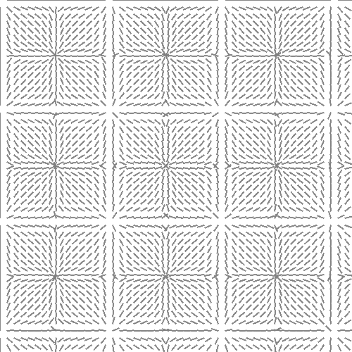
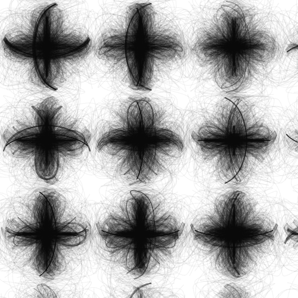

### Vector-field

This is a little "experiment" with particles which are influenced by a vector-field. Wikipedia: "A vector field is an assignment of a vector to each point in a subset of space."

##### This video might give you some idea of what vector-fields are.
https://www.youtube.com/watch?v=rB83DpBJQsE

### Example
```js
function z(position) {
  const x = position.x / width;
  const y = position.y / height;

  return new Vector(
    Math.sin(x * 20),
    Math.sin(y * 20)
  );
}
```


